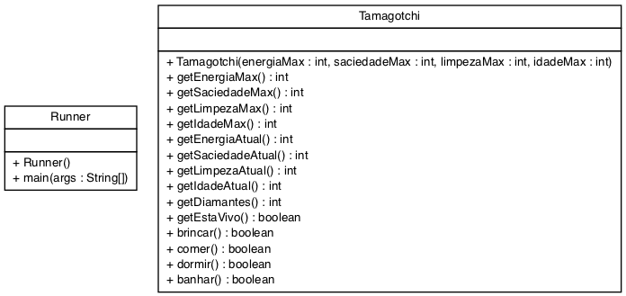

# Tamagotchi Smarthwatch


A Bandai, empresa desenvolvedora do icônico **Tamagotchi**, anunciou que irá lançar o **Tamagotchi Smart**, versão em smartwatch do bichinho virtual que fez sucesso nos anos 90. E é claro que a função mais esperada no dispositivo é um tamagotchi que vai ser possível brincar, fazer cócegas, além de prestar os mesmos cuidados de alimentação e saúde que a versão tradicional exigia. Portanto, a empresa convidou você para desenvolver o bichinho virtual.

Nesta versão o tamagotchi poderá comer, brincar, dormir e tomar banho. E eventualmente morrerá, se você não cuidar bem dele.

- [Requisitos](#requisitos)
- [Diagrama](#diagrama)
- [Exemplo de execução](#exemplo-de-execução)
- [Relatório de Entrega](#relatório-de-entrega)


## Requisitos

- Inicializar
  - Para inicializar um tamagotchi você precisará passar a energia, saciedade, limpeza e idade máximas dele.
  - Todos os níveis devem ser iniciados no máximo ao criar um tamagotchi.
  - Outros atributos são:
    - diamantes, que ele vai ganhar jogando.
    - idade, que aumenta a cada ação realizada.
    - ambos iniciados em 0.
- Ações: brincar, comer, dormir e tomar banho
  - Cada ação causa aumento e reduções nos atributos
  - Nenhum atributo pode passar do máximo ou ir abaixo de 0.
- Morrendo
  - Se algum atributo chegar a 0, o tamagotchi morre e nenhuma ação pode ser feita a não ser mostrar os dados.
- Brincar
  - Altera em -2 a energia, -1 a saciedade, -3 a limpeza, +1 diamante, +1 na idade.
- Comer
  - Altera em -1 a energia, +4 a saciedade, -2 a limpeza, +0 diamante, +1 na idade.
- Dormir
  - Altera a energia até o máximo, -2 a saciedade, idade aumenta do número de turnos que o pet dormiu.
  - Para que o tamagotchi durma, ele precisa ter perdido pelo menos 5 pontos de energia.
- Tomar banho
  - Altera em -3 a energia, -1 a saciedade, limpeza até o máximo, +0 diamante, +2 na idade.

## Diagrama


## Exemplo de execução 
```java
public class Runner {

    public static void main(final String[] args) {

        Tamagotchi tamagotchi = new Tamagotchi(20, 10, 15, 30);
        System.out.println(tamagotchi);
        // E:20/20, S:10/10, L:15/15, D:0, I:0

        tamagotchi.brincar();
        System.out.println(tamagotchi);
        // E:18/20, S:9/10, L:12/15, D:1, I:1

        tamagotchi.comer();
        System.out.println(tamagotchi);
        // E:17/20, S:10/10, L:10/15, D:1, I:2

        tamagotchi.brincar();
        tamagotchi.brincar();

        tamagotchi.dormir();
        System.out.println(tamagotchi);
        // E:20/20, S:6/10, L:4/15, D:3, I:11 

        tamagotchi.banhar();
        System.out.println(tamagotchi);

        if(!tamagotchi.dormir()){
            System.out.println("fail: o tamagotchi não está com sono");
        } // fail: o tamagotchi não está com sono

        tamagotchi.brincar();
        tamagotchi.brincar();
        tamagotchi.brincar();
        tamagotchi.brincar();
        tamagotchi.brincar();
        System.out.println(tamagotchi);
        // E:7/20, S:0/10, L:0/15, D:8, I:18

        if(!tamagotchi.comer()){
            System.out.println("fail: o seu tamagotchi morreu.");  
        }//fail: o seu tamagotchi morreu.

        if(!tamagotchi.dormir()){
            System.out.println("fail: o seu tamagotchi morreu.");
        }//fail: o seu tamagotchi morreu.
        if(!tamagotchi.brincar()){
            System.out.println("fail: o seu tamagotchi morreu.");
        }//fail: o seu tamagotchi morreu.

        if(!tamagotchi.banhar()){
            System.out.println("fail: o seu tamagotchi morreu.");
        }//fail: o seu tamagotchi morreu.
    }
}
```
## Relatório de Entrega
Não esqueça de preencher o seguinte formulário [Link para formulário](https://forms.gle/tQae7smoV4BSHHyC6) ao completar a atividade.
